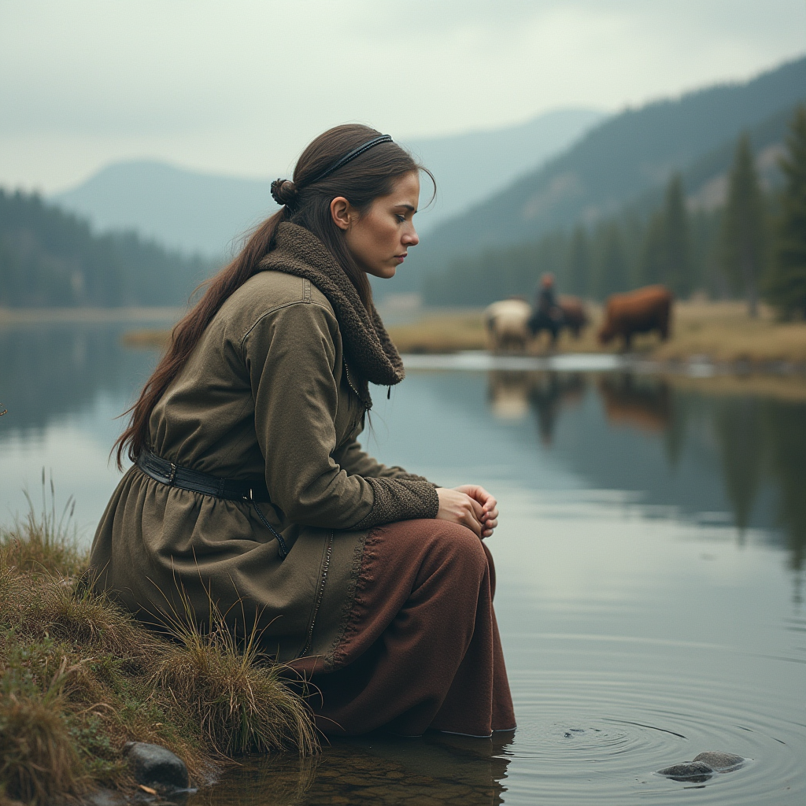
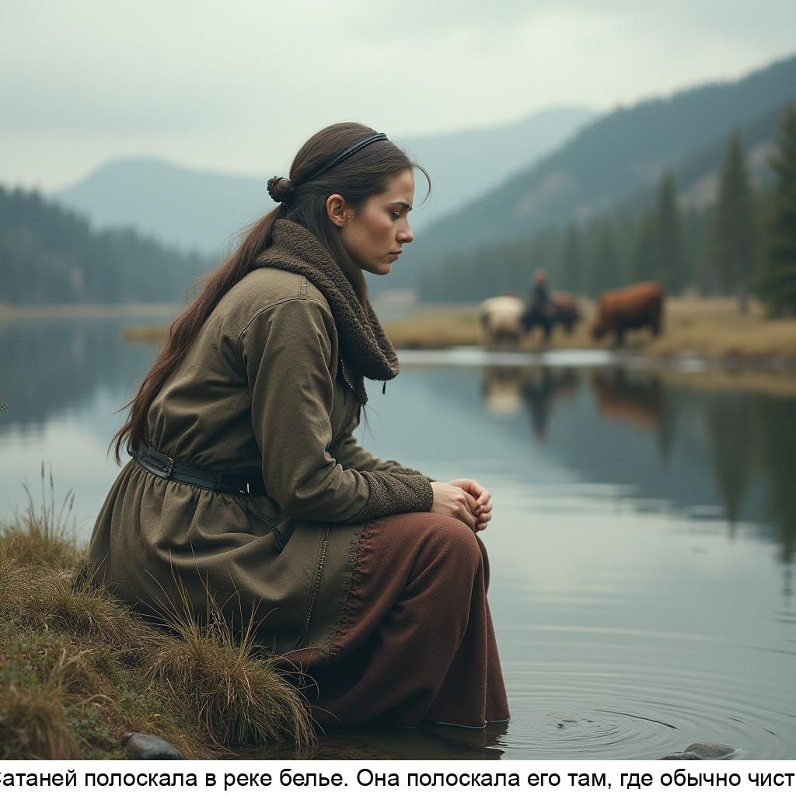
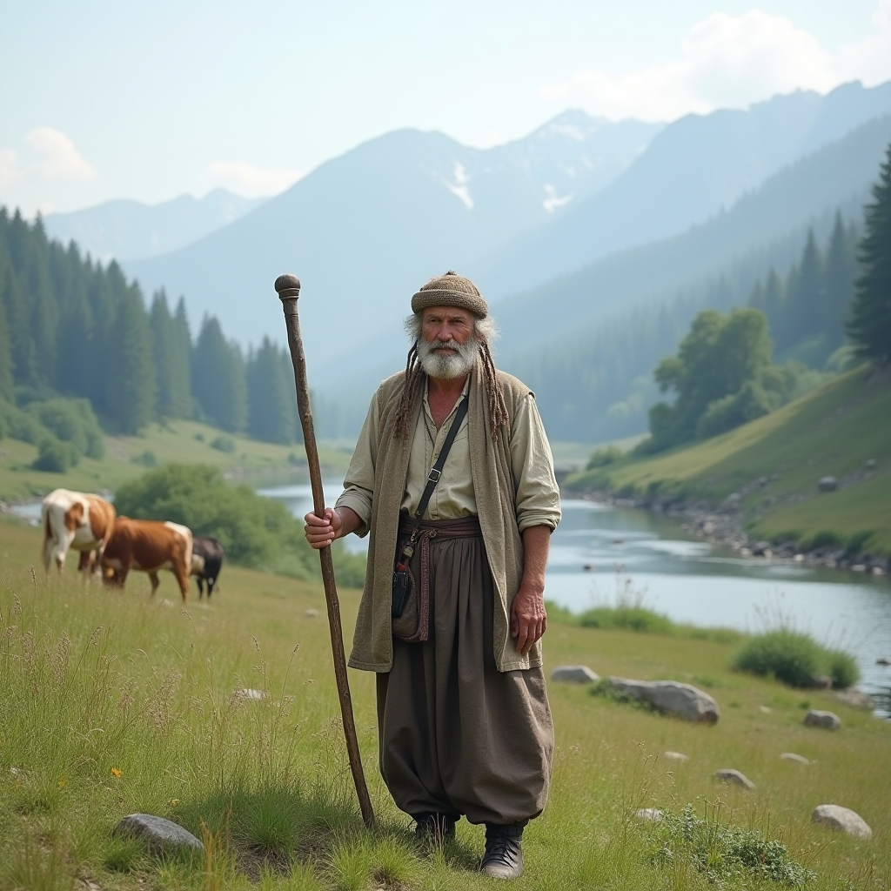
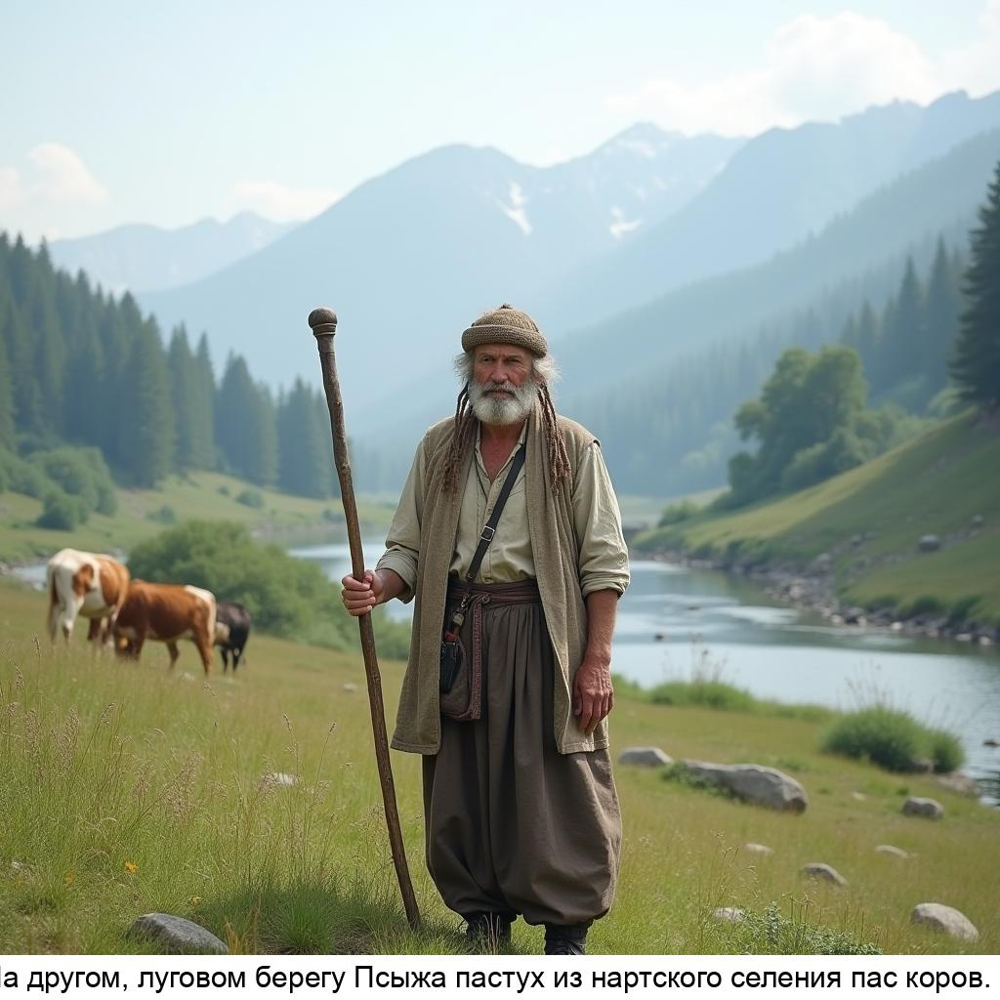
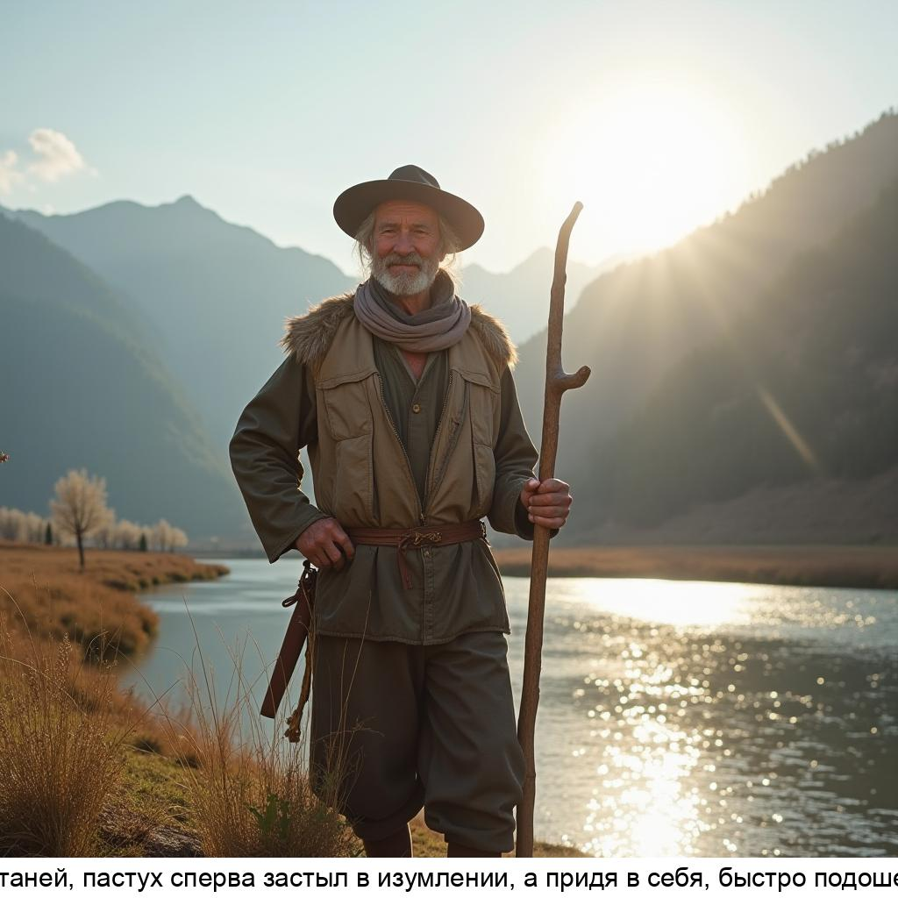

# Описание проекта

Иллюстрировать сказку с помощью искусственного интеллекта

# Реализация

Сказка описывается с помощью файла JSON структуры
```json
{
    "name": "Первая история",
    "description": "",
    "persons": [
        {
            "name": "Сатаней",
            "description": "Тонкобровая. Мать и воспитательница нартов, мудрая наставница и советчица, хозяйка и распорядительница всего нартского хозяйства, женщина неувядающей красоты. Организатор, глава нартского общества, её авторитет непререкаем."
        }
    ],
    "scenes": [
        {
            "name": "01",
            "text": "Тонкобровая Сатаней полоскала в реке белье. Она полоскала его там, где обычно чистила кольчуги.",
            "description": "Девушка [Сатаней] сидит на берегу реки и полоскает в реке белье. На заднем фоне кавказские горы, на другом берегу в далеке пастух пасущий коров"
        }
    ]
}
```

В разделе `persons` описываются персонажи, описание заменяется по тексту сцены в тэгах `[persons.name]`

В разделе `scenes` описываются сцены, поле `name` предназначено для именования сцены, поле `text` используется для отображения пользователю на итоговом фото, поле `description` используется для создания промпта для генерации фотографии.

# Исполнение

## 1. Загружаем файл истории `storys/first/story.json`

## 2. Отправляем каждую сцену на генерацию фоток

Для каждой сцены берем поле `description`:
* ищем вставки `[person.name]` и заменяем на `person.name`(`person.description`) 
* отправляем в online переводчик получаем перевод в поле `prompt` и отправляем на генерацию фото.

Генерация фото происходит по ранее заготовленному `worksheet` который расположен в папке `workflows/flux_dev_checkpoint_example.json` в ComfyUI заранее подготовлен, протестирован и сохранен как "Экспорт API"

## 3. Сохраняем обновленный массив в файл

После отправки всех сцен на генерацию фото, получаем данные для проверки процесса генерации и сохраняем в файл сказки JSON для дальнейшего использования.

Структура `scenes` сцены дополнится данными:

```json
[
  {
    "prompt": "The girl Satan (Subarobrovka. Mother and educator of sledges, a wise mentor and adviser, the mistress and manager of the entire Nart economy, a woman of unfading beauty. Organizer, the head of the Nart society, her authority is indisputable.) Sits on the banks of the river and rinses in the river underwear. In the background of the Caucasian mountains, on the other side in the far, shepherd grazing cows",
    "result": {
      "prompt_id": "f5c93998-f95f-4375-88ea-8126e54e9729",
      "number": 66,
      "node_errors": {}
    }
  }
]
```

При последующих запросах проверяем наличие полей `prompt` если есть то не делаем перевод, `result` если есть, то не шлем промпт на генерацию фото

## 4. Проверяем готовность фото 

TODO: надо проверить готова ли фото в цикле?

Проверка готовности фото, т.к. фотки генерируются за 30-40 секунд, надо ждать готовности, ComfUI реализует очередь сама.

Если фото получаем, скачиваем его в директорию `imgs` и обновляем структуру сцены сказки, добавля поле `photo`

```json
[
  {
    "photo": "ComfyUI_00182_.png"
  }
]
```

## 5. Сохраняем обновленный массив в файл

Сохраняем в файл сказки JSON для дальнейшего использования.

## 6. Создаем фотоколлаж

Обходим все сцены сказки проверяем наличие поля `photo` и при наличии накладываем текст поверх фотографии

TODO: доделать красивое оформление

# Пример

## 1. Исходная структура сцены
```json
{
    "name": "01",
    "text": "Тонкобровая Сатаней полоскала в реке белье. Она полоскала его там, где обычно чистила кольчуги.",
    "description": "Девушка [Сатаней] сидит на берегу реки и полоскает в реке белье. На заднем фоне кавказские горы, на другом берегу в далеке пастух пасущий коров"
}
```

## 2. Переведенный текст описания сцены в `prompt`
```json
{
    "name": "01",
    "text": "Тонкобровая Сатаней полоскала в реке белье. Она полоскала его там, где обычно чистила кольчуги.",
    "description": "Девушка [Сатаней] сидит на берегу реки и полоскает в реке белье. На заднем фоне кавказские горы, на другом берегу в далеке пастух пасущий коров",
    "prompt": "The girl Satan (Subarobrovka. Mother and educator of sledges, a wise mentor and adviser, the mistress and manager of the entire Nart economy, a woman of unfading beauty. Organizer, the head of the Nart society, her authority is indisputable.) Sits on the banks of the river and rinses in the river underwear. In the background of the Caucasian mountains, on the other side in the far, shepherd grazing cows"
}
```

## 3. Результат отправки промпта на генерацию `result`

```json
{
    "name": "01",
    "text": "Тонкобровая Сатаней полоскала в реке белье. Она полоскала его там, где обычно чистила кольчуги.",
    "description": "Девушка [Сатаней] сидит на берегу реки и полоскает в реке белье. На заднем фоне кавказские горы, на другом берегу в далеке пастух пасущий коров",
    "prompt": "The girl Satan (Subarobrovka. Mother and educator of sledges, a wise mentor and adviser, the mistress and manager of the entire Nart economy, a woman of unfading beauty. Organizer, the head of the Nart society, her authority is indisputable.) Sits on the banks of the river and rinses in the river underwear. In the background of the Caucasian mountains, on the other side in the far, shepherd grazing cows",
    "result": {
        "prompt_id": "f5c93998-f95f-4375-88ea-8126e54e9729",
        "number": 66,
        "node_errors": {}
    }
}
```

## 4. Получение фотографии

```json
{
    "name": "01",
    "text": "Тонкобровая Сатаней полоскала в реке белье. Она полоскала его там, где обычно чистила кольчуги.",
    "description": "Девушка [Сатаней] сидит на берегу реки и полоскает в реке белье. На заднем фоне кавказские горы, на другом берегу в далеке пастух пасущий коров",
    "prompt": "The girl Satan (Subarobrovka. Mother and educator of sledges, a wise mentor and adviser, the mistress and manager of the entire Nart economy, a woman of unfading beauty. Organizer, the head of the Nart society, her authority is indisputable.) Sits on the banks of the river and rinses in the river underwear. In the background of the Caucasian mountains, on the other side in the far, shepherd grazing cows",
    "result": {
        "prompt_id": "f5c93998-f95f-4375-88ea-8126e54e9729",
        "number": 66,
        "node_errors": {}
    },
    "photo": "ComfyUI_00182_.png"
}
```

## 5. Результат

| Текст сцены                                                                                                                                                                                                                                                                                                                                                                    | Фото                                          | Результат                                  |
|--------------------------------------------------------------------------------------------------------------------------------------------------------------------------------------------------------------------------------------------------------------------------------------------------------------------------------------------------------------------------------|-----------------------------------------------|--------------------------------------------|
| Девушка Сатаней(Тонкобровая. Мать и воспитательница нартов, мудрая наставница и советчица, хозяйка и распорядительница всего нартского хозяйства, женщина неувядающей красоты. Организатор, глава нартского общества, её авторитет непререкаем.) сидит на берегу реки и полоскает в реке белье. На заднем фоне кавказские горы, на другом берегу в далеке пастух пасущий коров |  |   |
| На луговом берегу Псыж(горная река) стоит пастух(простолюдин одет в обычные одежды, имеет посох) в руке посох в далеке видны пасущиеся коровы. На заднем фоне Кавказские горы.                                                                                                                                                                                                 |  |   |
| пастух(простолюдин одет в обычные одежды, имеет посох) с счастливым лицом стоит оперевшись на посох. На переднем плане виден берег реки на заднем фоне Кавказские горы с ярким солнцем.                                                                                                                                                                                                                                      |  |   |
